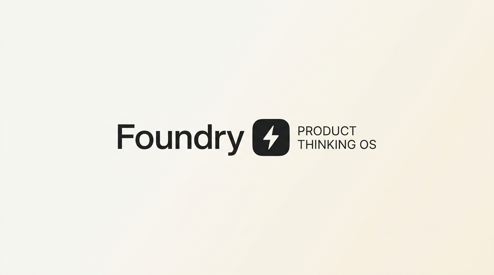

<div align="center">
  <picture>
    <source media="(prefers-color-scheme: dark)" srcset="foundry_banner_dark.jpg">
    
  </picture>
  
  <br/>
  <br/>

  <h1>🚀 Foundry</h1>
  
  <p>
    <b>The premium Product Thinking Operating System for founders, engineers, and researchers to capture and structure product thinking.</b>
  </p>

  <p>
    <a href="#features"><strong>Explore Features</strong></a> ·
    <a href="#getting-started"><strong>Getting Started</strong></a> ·
    <a href="#tech-stack"><strong>Tech Stack</strong></a>
  </p>

  <br/>
</div>

---

## 💡 What is Foundry?

Foundry is an advanced workspace designed for creators to manage, refine, and stress-test their ideas. It leverages cutting-edge AI (Google Gemini) and autonomous agents (Antigravity) to act as a Co-Pilot in your product development journey. Capture raw ideas, run autonomous SWOT analysis, track milestones, and visualize your roadmap—all in one place.

## ✨ Key Features

- **🧠 AI Co-Pilot:** Instantly **Improve** your prose, **Audit** for vulnerabilities/blindspots, or **Expand** your ideas to generate an MVP scope, business models, and implementation roadmaps.
- **⚡ Antigravity Agent:** Trigger autonomous agents to deeply research and perform automated SWOT analysis on your ideas.
- **🗂️ Idea Workspace:** A structured canvas for defining problem statements, proposed solutions, unique insights, and MVP requirements.
- **📅 Forge Timeline & Milestones:** Track progress, set milestones, and visualize the product journey.
- **🔌 MCP Integrations:** Extend functionality with Model Context Protocol (MCP) servers.
- **⌨️ Command Palette:** Lightning-fast navigation and actions using the `⌘K` or `Ctrl+K` interface.
- **🌗 Beautiful UI/UX:** Stunning, responsive interface powered by Tailwind CSS and Framer Motion, featuring native Light and Dark modes.

## 🛠️ Tech Stack

### Frontend
- **Framework:** [React 19](https://react.dev/) + [Vite](https://vitejs.dev/)
- **Styling:** [Tailwind CSS 4](https://tailwindcss.com/)
- **Animations:** [Framer Motion](https://motion.dev/)
- **Icons:** [Lucide React](https://lucide.dev/)
- **Markdown & Diagrams:** `react-markdown`, `remark-gfm`, and `mermaid`

### Backend & AI
- **Server:** [Express](https://expressjs.com/) & [Node.js](https://nodejs.org/)
- **AI Integration:** `@google/genai` (Google Gemini API)
- **TypeScript:** End-to-end type safety

---

## 🚀 Getting Started

Follow these instructions to get a copy of the project up and running on your local machine.

### Prerequisites

- [Node.js](https://nodejs.org/) (v18 or higher recommended)
- `npm` or `yarn`

### Installation

1. **Clone the repository** (if applicable) or navigate to the project directory:
   ```bash
   cd Foundry
   ```

2. **Install dependencies:**
   ```bash
   npm install
   ```

3. **Set up environment variables:**
   Copy the example environment file and configure your API keys (like your Google Gemini API key):
   ```bash
   cp .env.example .env
   ```
   *Make sure to fill in the required keys in the `.env` file.*

4. **Run the development server:**
   ```bash
   npm run dev
   ```
   This will start both the frontend and the backend using `tsx`.

5. **Build for production:**
   ```bash
   npm run build
   npm start
   ```

---

## 📸 Sneak Peek

<div align="center">
  
</div>

*(Note: Actual UI screenshots may differ as the platform evolves!)*

---

## 🤝 Contributing

Contributions, issues, and feature requests are welcome! Feel free to check the [ISSUES.md](ISSUES.md) page if you want to contribute.

## 📄 License

This project is private and proprietary unless otherwise stated.

---
<div align="center">
  <i>Built with ❤️ for visionaries and builders.</i>
</div>
