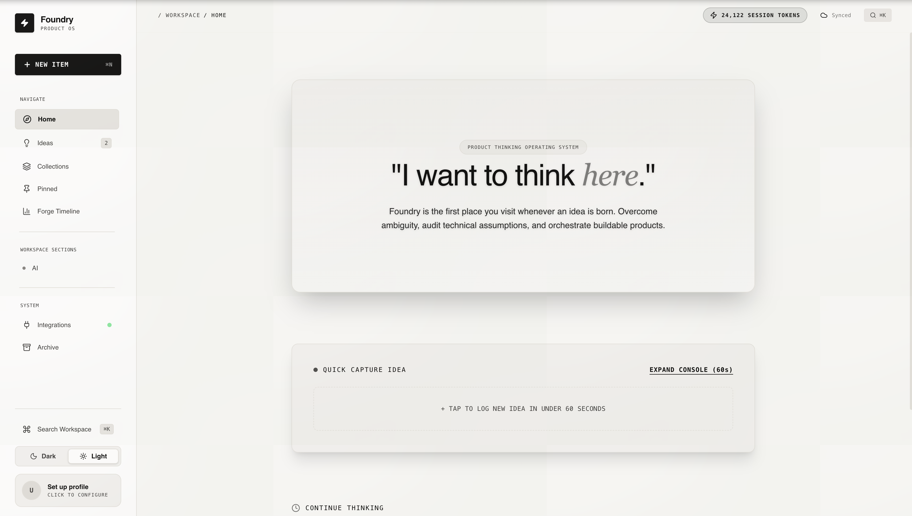
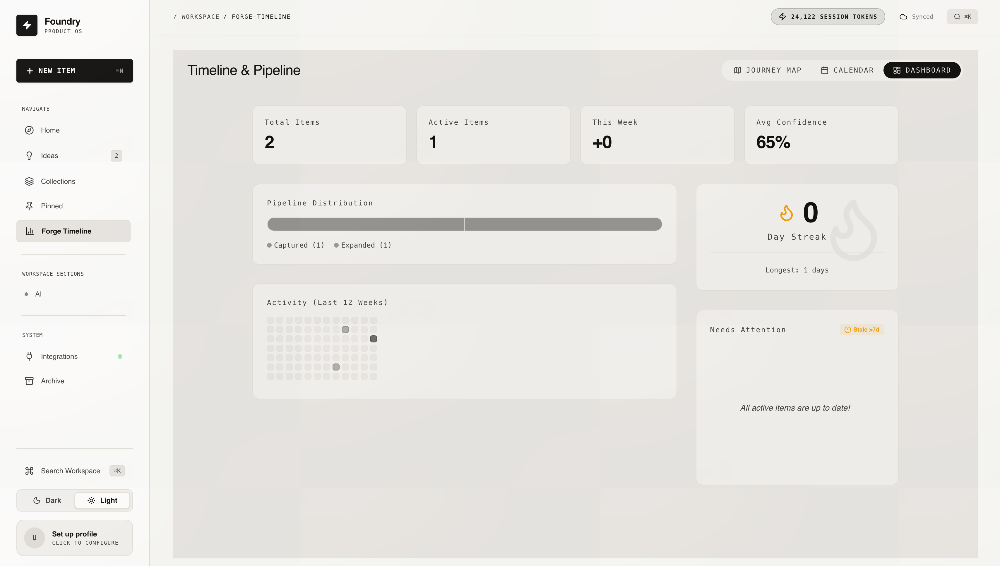
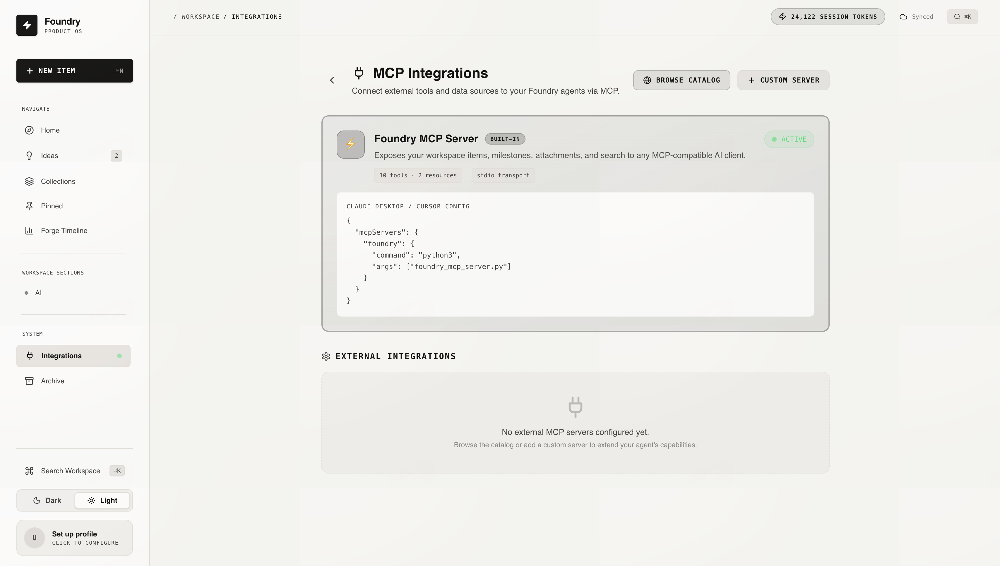

<div align="center">
  
  
  <br/>
  <br/>

  <h1>🚀 Foundry</h1>
  
  <p>
    <b>The AI-Native Product Development Operating System — from raw idea to deployed product, orchestrated by autonomous agents.</b>
  </p>

  <p>
    <a href="#features"><strong>Features</strong></a> ·
    <a href="#architecture"><strong>Architecture</strong></a> ·
    <a href="#getting-started"><strong>Getting Started</strong></a> ·
    <a href="#tech-stack"><strong>Tech Stack</strong></a> ·
    <a href="#roadmap"><strong>Roadmap</strong></a>
  </p>

  <br/>
</div>

---

## 💡 What is Foundry?

Foundry is an AI-native Product Development Operating System. It is the single environment where a product goes from a raw thought — captured via voice, browser extension, or keyboard — through AI-powered validation, autonomous market research, technical architecture, financial modeling, and all the way to a scaffolded GitHub repo with a live landing page.

Think of it as the **Autonomous Co-Founder**: a workspace where every idea gets the rigor of a venture partner's review, the depth of a staff engineer's architecture doc, the financial scrutiny of a CFO's spreadsheet, and the execution speed of a full dev team — powered by autonomous AI agents at every phase.

---

## ✨ Features

### Core Workspace
- **🧠 AI Co-Pilot** — Instantly **Improve** your prose, **Audit** for vulnerabilities/blindspots, or **Expand** ideas into full MVP scopes, business models, and implementation roadmaps
- **🗂️ Structured Idea Canvas** — Define problem statements, proposed solutions, unique insights, target audiences, and MVP requirements in a rich Markdown editor
- **📅 Forge Timeline & Milestones** — Track progress, set milestones, and visualize the product journey
- **🖼️ Moodboard** — Drag-and-drop image boards with text cards and file attachments
- **⌨️ Command Palette** — Lightning-fast navigation and actions via `⌘K` / `Ctrl+K`
- **🌗 Light & Dark Modes** — Stunning, responsive UI with native theme switching

### AI & Agent Layer
- **⚡ Autonomous Agent (Antigravity)** — Trigger deep market research and automated SWOT analysis via a custom Python FastAPI microservice with full MCP tool integration
- **🔍 Agent Traceability UI** — Full interpretability panel showing the agent's exact chain-of-thought, every tool it called, raw tool outputs, and execution timing — critical for AI alignment and trust
- **🔀 Multi-Provider LLM Router** — Route AI requests across **6 free-tier providers** (Gemini, Groq, Mistral, Cerebras, OpenRouter, Ollama) with automatic fallback, rate limiting, and task-aware model selection. Stack ~35,000+ free requests/day across providers
- **🌳 Idea Version Control** — Snapshot ideas, ask AI to pivot them in new directions, and visualize the evolution as an interactive branch tree (powered by React Flow)

### Integrations & Ecosystem
- **🔌 MCP Integrations** — Connect external tools (GitHub, Brave Search, Slack, Notion, Filesystem) via Model Context Protocol servers
- **📎 Attachments** — Local file uploads with `multer` for documents and reference materials

---

## 🏗️ Architecture

```
┌─────────────────────────────────────────────────────────┐
│                    React 19 Frontend                     │
│  Editor · Co-Pilot · Agent Trace · Version Tree          │
│  Moodboard · Timeline · Command Palette · Settings       │
├─────────────────────────────────────────────────────────┤
│                 Node.js / Express Backend                │
│                                                          │
│  ┌──────────────┐  ┌──────────────┐  ┌──────────────┐  │
│  │  LLM Router  │  │  REST API    │  │  MCP Bridge  │  │
│  │  (6 providers│  │  (Items,     │  │  (Tool       │  │
│  │   w/ fallback│  │   Snapshots, │  │   calling)   │  │
│  │   & rate lim)│  │   Moodboard) │  │              │  │
│  └──────┬───────┘  └──────────────┘  └──────────────┘  │
│         │                                                │
│  ┌──────▼──────────────────────────────────────────┐    │
│  │ Gemini → Groq → Mistral → Cerebras → Ollama    │    │
│  └─────────────────────────────────────────────────┘    │
├─────────────────────────────────────────────────────────┤
│            Python FastAPI Agent Service                  │
│  Antigravity Agents · Telemetry Hooks · MCP Tools        │
├─────────────────────────────────────────────────────────┤
│                   JSON File Database                     │
│              data/db.json · attachments · moodboard      │
└─────────────────────────────────────────────────────────┘
```

---

## 🛠️ Tech Stack

### Frontend
| Technology | Purpose |
|---|---|
| [React 19](https://react.dev/) + [Vite](https://vitejs.dev/) | UI framework & dev server |
| [Tailwind CSS 4](https://tailwindcss.com/) | Utility-first styling |
| [Framer Motion](https://motion.dev/) | Animations & transitions |
| [@xyflow/react](https://reactflow.dev/) | Interactive node-based diagrams |
| [Lucide React](https://lucide.dev/) | Icon system |
| `react-markdown` + `mermaid` | Rich Markdown rendering with diagrams |

### Backend & AI
| Technology | Purpose |
|---|---|
| [Express](https://expressjs.com/) + [Node.js](https://nodejs.org/) | REST API server |
| [TypeScript](https://www.typescriptlang.org/) | End-to-end type safety |
| `@google/genai` (Gemini API) | Primary AI provider |
| Multi-Provider LLM Router | Groq, Mistral, Cerebras, OpenRouter, Ollama |
| [Python FastAPI](https://fastapi.tiangolo.com/) | Autonomous agent microservice |
| [MCP (Model Context Protocol)](https://modelcontextprotocol.io/) | Tool calling & external integrations |
| [multer](https://github.com/expressjs/multer) | File upload handling |

---

## 🚀 Getting Started

### Prerequisites
- [Node.js](https://nodejs.org/) v18+
- [Python 3.10+](https://www.python.org/) (for the agent service)
- `npm`

### Installation

```bash
# Clone the repo
git clone https://github.com/Arc-coder07/Foundry.git
cd Foundry

# Install dependencies
npm install

# Set up environment variables
cp .env.example .env
# Add your GEMINI_API_KEY (free at https://aistudio.google.com)

# Run the development server
npm run dev
```

### Optional: Add Free LLM Providers

Foundry works with just a Gemini key, but you can add more providers for free to maximize your AI quota:

1. Open the app → **Settings > LLM Providers**
2. Add API keys from any of these (all free, no credit card):
   - [Groq](https://console.groq.com) — Ultra-fast inference
   - [Mistral](https://console.mistral.ai) — High volume (1B tokens/month)
   - [Cerebras](https://cloud.cerebras.ai) — High throughput
   - [OpenRouter](https://openrouter.ai) — Model variety
3. Or install [Ollama](https://ollama.com) for unlimited local AI with zero API keys

---

## 📸 Screenshots

<div align="center">
  
  <br/><br/>
  
  <br/><br/>
  
</div>

---


---

## 📁 Project Structure

```
Foundry/
├── server.ts                  # Express backend + LLM Router init
├── server/
│   └── llm-router.ts          # Multi-provider LLM abstraction layer
├── agent-service/
│   ├── agents.py              # Antigravity agent with telemetry hooks
│   └── main.py                # FastAPI endpoints for agent tasks
├── src/
│   ├── App.tsx                # Main application shell
│   ├── types.ts               # Shared TypeScript interfaces
│   └── components/
│       ├── Editor.tsx          # Workspace editor (canvas, moodboard, trace, versions)
│       ├── AgentTracePanel.tsx # Agent interpretability timeline
│       ├── IdeaVersionTree.tsx # React Flow version branching
│       ├── LLMProviderSettings.tsx # Multi-provider config UI
│       ├── IntegrationsView.tsx # MCP server management
│       ├── CoPilotDrawer.tsx   # AI assist drawer
│       └── ...
├── docs/                      # Feature designs & roadmap
└── data/                      # JSON database & uploads
```

---

## 🤝 Contributing

Contributions, issues, and feature requests are welcome! Check [ISSUES.md](ISSUES.md) for known issues.

## 📄 License

This project is private and proprietary unless otherwise stated.

---
<div align="center">
  <i>Built with ❤️ for visionaries and builders.</i>
</div>
