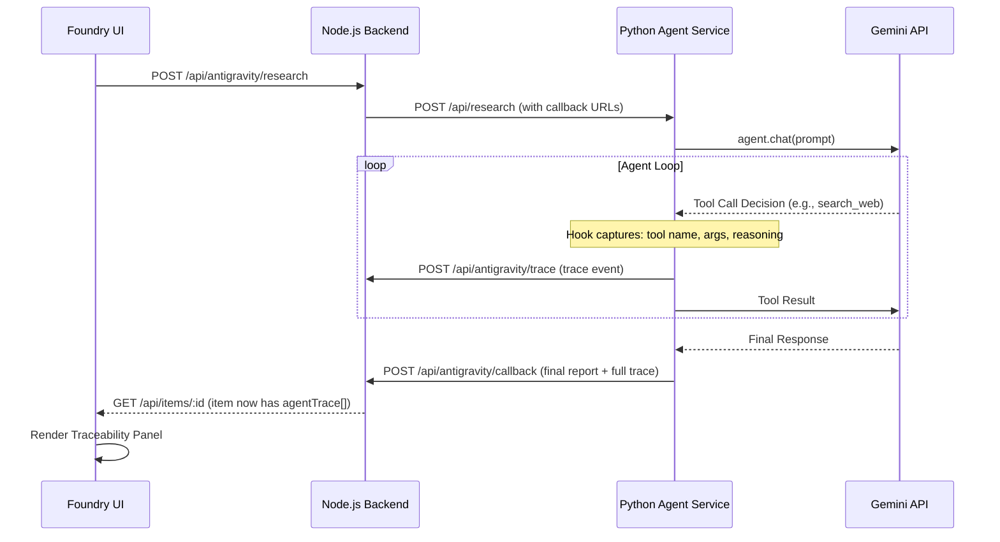
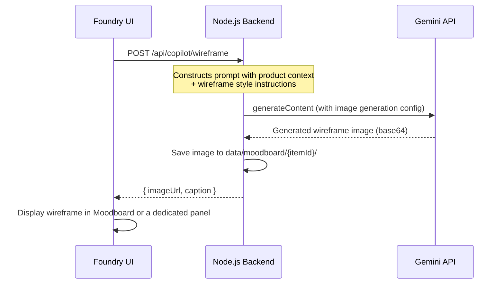

# Implementation Plan: Foundry v2 — Four Major Features

A detailed technical plan for adding Agent Traceability, Idea Version Control, GitHub/Linear Integration, and Wireframe Generation to the Foundry workspace.

---

## Feature 1: Agent Traceability UI (Interpretability)

### What It Is

Instead of only showing the agent's final Markdown report, we capture **every step** of the agent's reasoning process — every tool it decided to call, the raw output it received, and its internal chain-of-thought — and display it in a dedicated UI panel. This is the single most impressive feature for AI Alignment roles because it directly demonstrates **interpretability** and **observability** of autonomous AI systems.

### How It Works (End-to-End Flow)



### Data Model Changes

#### [MODIFY] [`types.ts`](file:///Users/amarnadhpb/Desktop/Projects/Foundry/src/types.ts)

Add a new `AgentTraceEvent` interface and attach it to `WorkspaceItem`:

```typescript
export interface AgentTraceEvent {
  id: string;
  timestamp: string;
  type: 'thought' | 'tool_call' | 'tool_result' | 'final_response' | 'error';
  // For 'thought': the agent's internal reasoning text
  // For 'tool_call': the tool name + arguments
  // For 'tool_result': the raw output from the tool
  content: string;
  toolName?: string;        // e.g., "search_web", "foundry_list_items"
  toolArgs?: Record<string, any>;  // The arguments passed to the tool
  durationMs?: number;      // How long the tool call took
}

// Add to WorkspaceItem:
export interface WorkspaceItem {
  // ... existing fields ...
  agentTrace?: AgentTraceEvent[];  // NEW: Full reasoning trace
}
```

### Backend Changes

#### [MODIFY] [`agents.py`](file:///Users/amarnadhpb/Desktop/Projects/Foundry/agent-service/agents.py)

Enhance the `@hooks.pre_tool_call_decide` and add a `@hooks.post_tool_call` hook to capture full trace events:

```python
import time

trace_events: list[dict] = []

@hooks.pre_tool_call_decide
async def capture_pre_tool(tool_call: types.ToolCall) -> types.HookResult:
    event = {
        "id": f"trace-{int(time.time() * 1000)}",
        "timestamp": datetime.now().isoformat(),
        "type": "tool_call",
        "content": f"Calling {tool_call.name}",
        "toolName": tool_call.name,
        "toolArgs": tool_call.args if hasattr(tool_call, 'args') else {},
        "startTime": time.time()
    }
    trace_events.append(event)
    
    # Send live progress
    async with httpx.AsyncClient(timeout=5.0) as client:
        await client.post(request_data.progress_url, json={
            "item_id": request_data.item_id,
            "progress": f"Calling tool: {tool_call.name}",
            "trace_event": event
        })
    return types.HookResult(allow=True)

@hooks.post_tool_call
async def capture_post_tool(tool_call, result) -> types.HookResult:
    event = {
        "id": f"trace-{int(time.time() * 1000)}",
        "timestamp": datetime.now().isoformat(),
        "type": "tool_result",
        "content": str(result)[:2000],  # Truncate large outputs
        "toolName": tool_call.name,
        "durationMs": int((time.time() - trace_events[-1].get("startTime", time.time())) * 1000)
    }
    trace_events.append(event)
    return types.HookResult(allow=True)
```

Then include `trace_events` in the callback payload:

```python
payload = {
    "item_id": request_data.item_id,
    "status": "completed",
    "result": content,
    "trace": trace_events,  # NEW
    "usage": usage_dict
}
```

#### [MODIFY] [`server.ts`](file:///Users/amarnadhpb/Desktop/Projects/Foundry/server.ts)

Update the `/api/antigravity/callback` endpoint to store the trace, and add a new `/api/antigravity/trace` endpoint for live trace streaming:

```typescript
// New: Live trace event endpoint
app.post("/api/antigravity/trace", async (req, res) => {
  const { item_id, trace_event } = req.body;
  const items = readDatabase();
  const index = items.findIndex(i => i.id === item_id);
  
  if (index !== -1) {
    if (!items[index].agentTrace) items[index].agentTrace = [];
    items[index].agentTrace.push(trace_event);
    writeDatabase(items);
  }
  res.json({ success: true });
});

// Update existing callback to store full trace
// In the "completed" branch of /api/antigravity/callback:
if (req.body.trace) {
  items[index].agentTrace = req.body.trace;
}
```

### Frontend: Traceability Panel

#### [NEW] `src/components/AgentTracePanel.tsx`

A collapsible panel (can be a tab inside the Editor or a new drawer) that visualizes the agent's reasoning as a vertical timeline:

- Each `tool_call` event is shown as a card with the tool name, an icon, and the arguments.
- Each `tool_result` is shown as a collapsible raw output block.
- `thought` events show the agent's internal reasoning in an italic/muted style.
- `final_response` marks the end.
- Each event has a timestamp and duration badge.
- The overall panel has a summary header: "Agent made 7 tool calls in 34 seconds, using 12,450 tokens."

**UI Concept:**
```
┌──────────────────────────────────────────┐
│  🧠 AGENT TRACE • 7 Steps • 34s • 12.4k tokens  │
├──────────────────────────────────────────┤
│  ① 🔍 search_web                    [2.1s] │
│     query: "competitor analysis for..."     │
│     ▼ Raw Output (click to expand)          │
│                                              │
│  ② 🔍 read_url_content              [1.8s] │
│     url: "https://techcrunch.com/..."       │
│     ▼ Raw Output                            │
│                                              │
│  ③ 📦 foundry_list_items            [0.1s] │
│     filters: { type: "Idea" }               │
│     ▼ Raw Output                            │
│                                              │
│  ④ 💭 Internal Reasoning                    │
│     "Based on the competitor data, the      │
│      main threat is..."                     │
│                                              │
│  ⑤ ✅ Final Report Generated                │
└──────────────────────────────────────────┘
```

### How Users Interact With It

1. User triggers the **Antigravity Agent** on an idea (existing flow).
2. While the agent runs, trace events stream into the UI in real-time (via polling `/api/items/:id`).
3. After completion, the trace is permanently saved on the item.
4. User can open the **Agent Trace** tab/panel to review exactly *how* the agent reasoned, *what* tools it used, and *what* data it saw.
5. This is valuable for debugging ("why did the agent miss this competitor?") and for trust ("I can see the agent's work").

---

## Feature 2: Idea Version Control (Branching)

### What It Is

Users can **snapshot** the current state of an idea, then ask the AI to pivot it in a different direction. The original idea is preserved, and each pivot creates a "branch." A visual **tree diagram** (using React Flow) shows how the concept evolved over time.

### Data Model Changes

#### [MODIFY] [`types.ts`](file:///Users/amarnadhpb/Desktop/Projects/Foundry/src/types.ts)

```typescript
export interface IdeaSnapshot {
  id: string;
  parentSnapshotId: string | null; // null for the root
  itemId: string;                  // The workspace item this belongs to
  label: string;                   // e.g., "Original", "Pivot: B2B Focus"
  createdAt: string;
  createdBy: 'user' | 'ai';
  // Frozen copy of all core fields at snapshot time:
  data: {
    title: string;
    summary: string;
    problem: string;
    proposedSolution: string;
    uniqueInsight: string;
    targetAudience: string;
    mvp: string;
    businessModel: string;
    technicalChallenges: string;
  };
  aiPrompt?: string;  // The pivot instruction that created this branch
}

// Add to WorkspaceItem:
export interface WorkspaceItem {
  // ... existing fields ...
  snapshots?: IdeaSnapshot[];
  activeSnapshotId?: string | null;  // Which branch is currently "active"
}
```

### Backend Changes

#### [MODIFY] [`server.ts`](file:///Users/amarnadhpb/Desktop/Projects/Foundry/server.ts)

Add new endpoints:

```typescript
// Create a snapshot (manual save point)
app.post("/api/items/:id/snapshots", (req, res) => { ... });

// AI Pivot: Create a new branch by asking Gemini to pivot the idea
app.post("/api/items/:id/snapshots/pivot", async (req, res) => {
  // 1. Read the current item (or a specific snapshot)
  // 2. Send to Gemini with the pivot prompt
  // 3. Parse the AI response into structured fields
  // 4. Create a new IdeaSnapshot with parentSnapshotId = current
  // 5. Save and return
});

// Restore: Set a snapshot as the "active" working copy
app.post("/api/items/:id/snapshots/:snapshotId/restore", (req, res) => { ... });

// List snapshots for an item
app.get("/api/items/:id/snapshots", (req, res) => { ... });
```

### Frontend: Version Tree

#### [NEW] `src/components/IdeaVersionTree.tsx`

Uses **React Flow** (`@xyflow/react`) to render the snapshot tree:

- The **root node** is the original idea.
- Each **child node** is a pivot/branch.
- Nodes show: label, timestamp, creator (user/AI), and a brief diff summary.
- Clicking a node shows a **side-by-side diff** of that snapshot vs. its parent.
- A "Restore" button on each node sets it as the active working copy.
- A "Pivot from here" button triggers the AI to generate a new branch.

**UI Concept:**
```
                    ┌─────────────┐
                    │  Original   │
                    │  Aug 15     │
                    └──────┬──────┘
                     ┌─────┴─────┐
               ┌─────┴───┐  ┌───┴──────┐
               │ B2B Pivot│  │ Consumer │
               │ Aug 16   │  │ Aug 17   │
               │ (AI)     │  │ (User)   │
               └─────┬────┘  └──────────┘
                ┌────┴─────┐
                │Enterprise│
                │ Aug 18   │
                │ (AI)     │
                └──────────┘
```

### New Dependency

```bash
npm install @xyflow/react
```

---

## Feature 3: GitHub & Linear Integration

### What It Is

After the AI "Expands" an idea into an MVP scope, the user can click a button to automatically:
1. **Create a GitHub repository** with a scaffolded README, `.gitignore`, and issue templates.
2. **Create a Linear project** with populated epics and tickets derived from the AI's expansion.

This is powered by MCP — the agent uses the existing GitHub and Linear MCP servers from the integrations page.

### How It Works

This feature does **not** require building custom API integrations. Instead, it uses the **MCP servers already configured** in the Integrations view. The flow is:

1. User triggers "Expand" → AI generates MVP scope, roadmap, and feature list.
2. UI shows new action buttons: **"Push to GitHub"** and **"Push to Linear"**.
3. When clicked, the frontend calls a new backend endpoint.
4. The backend triggers a **new agent task** (similar to the research agent) that uses the GitHub/Linear MCP tools to create the repo/project.

### Backend Changes

#### [MODIFY] [`server.ts`](file:///Users/amarnadhpb/Desktop/Projects/Foundry/server.ts)

```typescript
// New endpoint: Trigger agent to push expanded idea to GitHub/Linear
app.post("/api/copilot/push", async (req, res) => {
  const { itemId, target, expandedContent, mcpServers } = req.body;
  // target: "github" | "linear"
  
  // Calls the Python agent service with a specialized prompt:
  // - For GitHub: "Create a repository named X, add a README with this content, 
  //   create issues for each feature in the MVP scope"
  // - For Linear: "Create a project named X, create issues for each 
  //   roadmap item with descriptions and priority labels"
});
```

#### [NEW] `agent-service/push_agent.py`

A new agent function that uses GitHub/Linear MCP tools:

```python
async def push_to_github(item_data, expanded_content, mcp_servers):
    """Agent that uses GitHub MCP tools to create a repo and issues."""
    prompt = f"""
    You have access to GitHub tools via MCP.
    Create a new repository called "{item_data['title'].lower().replace(' ', '-')}".
    Add a README.md with the following content: {expanded_content}
    Then create GitHub Issues for each feature listed in the MVP scope.
    """
    # Uses the same Agent framework but with GitHub MCP server
```

### Frontend Changes

#### [MODIFY] [`CoPilotDrawer.tsx`](file:///Users/amarnadhpb/Desktop/Projects/Foundry/src/components/CoPilotDrawer.tsx)

Add new action buttons in the drawer footer when `action === "expand"`:

```tsx
{action === "expand" && content && (
  <div className="flex gap-2">
    <button onClick={() => handlePushTo("github")}>
      🐙 PUSH TO GITHUB
    </button>
    <button onClick={() => handlePushTo("linear")}>
      📋 PUSH TO LINEAR
    </button>
  </div>
)}
```

> [!IMPORTANT]
> This feature requires the user to have the GitHub and/or Linear MCP servers configured and enabled in the Integrations view with valid API tokens. The UI should check for this and show a helpful message if not configured.

---

## Feature 4: Wireframe Generation

### What It Is

Users can generate wireframes directly from their product description. Instead of relying on a third-party API (like v0 or Fal.ai), we use **Gemini's native image generation** capability (`gemini-2.0-flash-preview-image-generation` or the Imagen model via `@google/genai`). This keeps the architecture simple (no new API keys), leverages the Google ecosystem you're already in, and can generate a wide variety of wireframes.

### Why Gemini Image Generation > Third Party

| Factor | v0 (Vercel) | Fal.ai | **Gemini Image Gen** |
|---|---|---|---|
| Extra API Key | ✅ Required | ✅ Required | ❌ Uses existing Gemini key |
| Wireframe Quality | Code-based (generates React code, not images) | Good, but generic | Excellent for wireframes with the right prompting |
| Versatility | Web UIs only | General images | Any wireframe type: mobile, desktop, dashboard, flow diagrams |
| Integration Effort | High (separate API) | Medium (REST API) | **Low** (already have `@google/genai` in the project) |
| Cost | Paid API | Paid API | **Included in Gemini API quota** |

### How It Works



### Backend Changes

#### [MODIFY] [`server.ts`](file:///Users/amarnadhpb/Desktop/Projects/Foundry/server.ts)

```typescript
app.post("/api/copilot/wireframe", async (req, res) => {
  const { itemId, wireframeType, customInstructions } = req.body;
  // wireframeType: "mobile-app" | "web-dashboard" | "landing-page" | 
  //                "admin-panel" | "user-flow" | "custom"
  
  const item = items.find(i => i.id === itemId);
  
  const prompt = `
    Generate a clean, professional wireframe for a ${wireframeType}.
    Product: ${item.title}
    Description: ${item.summary}
    Key Features: ${item.mvp || item.proposedSolution}
    ${customInstructions || ''}
    
    Style: Clean grayscale wireframe with clear UI components,
    labeled sections, and placeholder content. 
    Include: navigation, main content area, and key interactive elements.
  `;
  
  const response = await ai.models.generateContent({
    model: "gemini-2.0-flash-preview-image-generation",
    contents: prompt,
    config: {
      responseModalities: ["TEXT", "IMAGE"],
    }
  });
  
  // Extract image from response parts
  for (const part of response.candidates[0].content.parts) {
    if (part.inlineData) {
      const imageBuffer = Buffer.from(part.inlineData.data, 'base64');
      const filename = `wireframe_${Date.now()}.png`;
      const filepath = path.join(MOODBOARD_DIR, itemId, filename);
      fs.writeFileSync(filepath, imageBuffer);
      
      // Auto-add to moodboard
      const card = {
        id: `mood-${Date.now()}`,
        type: 'image',
        content: '',
        caption: `AI Wireframe: ${wireframeType}`,
        imageFilename: filename,
        createdAt: new Date().toISOString()
      };
      // ... save to item's moodboard array ...
      
      return res.json({ 
        imageUrl: `/api/moodboard/${itemId}/${filename}`,
        card 
      });
    }
  }
});
```

### Frontend Changes

#### [NEW] `src/components/WireframeGenerator.tsx`

A modal/panel accessible from the Editor that lets users:

1. **Select a wireframe type** from a grid of presets:
   - 📱 Mobile App Screen
   - 🖥️ Web Dashboard
   - 🏠 Landing Page
   - ⚙️ Admin Panel
   - 🔄 User Flow Diagram
   - 📊 Data Visualization
   - 🛒 E-Commerce Page
   - ✏️ Custom (free-form prompt)

2. **Add custom instructions** (optional text area): "Include a sidebar with filters, a data table with pagination, and a chart at the top."

3. **Click Generate** → Shows a loading state → Displays the generated wireframe.

4. **Actions on the result:**
   - **Save to Moodboard** — Adds it to the item's moodboard.
   - **Regenerate** — Try again with the same prompt.
   - **Iterate** — Edit the instructions and generate a new version based on the existing one (pass the image back to Gemini for editing).

**UI Concept:**
```
┌──────────────────────────────────────────────────┐
│  🎨 WIREFRAME GENERATOR                          │
├──────────────────────────────────────────────────┤
│                                                    │
│  Select Type:                                      │
│  ┌────────┐ ┌────────┐ ┌────────┐ ┌────────┐     │
│  │📱Mobile│ │🖥️ Web  │ │🏠Landing│ │⚙️Admin │     │
│  └────────┘ └────────┘ └────────┘ └────────┘     │
│  ┌────────┐ ┌────────┐ ┌────────┐ ┌────────┐     │
│  │🔄 Flow │ │📊 Data │ │🛒 Shop │ │✏️Custom│     │
│  └────────┘ └────────┘ └────────┘ └────────┘     │
│                                                    │
│  Custom Instructions (optional):                   │
│  ┌────────────────────────────────────────────┐   │
│  │ Include a sidebar with navigation...       │   │
│  └────────────────────────────────────────────┘   │
│                                                    │
│  [🎨 GENERATE WIREFRAME]                          │
│                                                    │
│  ┌────────────────────────────────────────────┐   │
│  │                                              │   │
│  │         [Generated Wireframe Image]          │   │
│  │                                              │   │
│  └────────────────────────────────────────────┘   │
│                                                    │
│  [Save to Moodboard]  [Regenerate]  [Iterate]     │
└──────────────────────────────────────────────────┘
```

---

## New Dependencies

```bash
# React Flow for Idea Version Control tree
npm install @xyflow/react
```

No other new dependencies are needed. Gemini image generation uses the existing `@google/genai` SDK. GitHub/Linear integration uses the existing MCP infrastructure.

---

## Verification Plan

### Automated Tests
- Test the new API endpoints (`/api/antigravity/trace`, `/api/items/:id/snapshots`, `/api/copilot/wireframe`) with `curl` commands.
- Verify trace events are correctly stored and retrieved.
- Verify snapshot creation, branching, and restoration.

### Manual Verification
1. **Traceability:** Run an Antigravity agent task and verify the trace panel shows all tool calls with timing data.
2. **Version Control:** Create an idea, snapshot it, trigger an AI pivot, and verify the React Flow tree renders correctly. Restore an old snapshot.
3. **GitHub Push:** Configure the GitHub MCP server, expand an idea, click "Push to GitHub," and verify the repo + issues are created.
4. **Wireframes:** Generate wireframes for different types and verify they save to the moodboard correctly.

---

## Open Questions

> [!IMPORTANT]
> **Gemini Image Generation Model:** The model `gemini-2.0-flash-preview-image-generation` supports native image output. We should verify the exact model name available under your API key. If not available, we can fall back to the Imagen 3 model via `ai.models.generateImages()`.

> [!IMPORTANT]
> **Implementation Priority:** Which feature would you like to build first? Recommended order:
> 1. **Agent Traceability** (adds the most resume value for AI Alignment)
> 2. **Wireframe Generator** (quick win, uses existing Gemini key)
> 3. **Idea Version Control** (biggest UI effort, React Flow)
> 4. **GitHub/Linear Push** (depends on having MCP servers configured)
